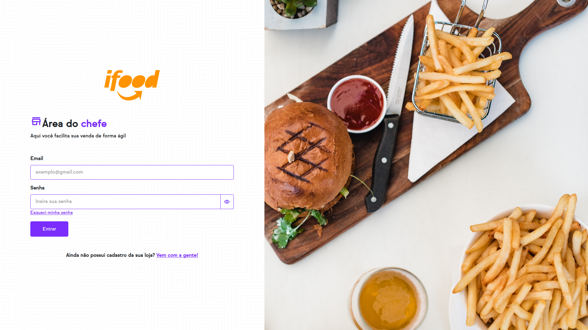
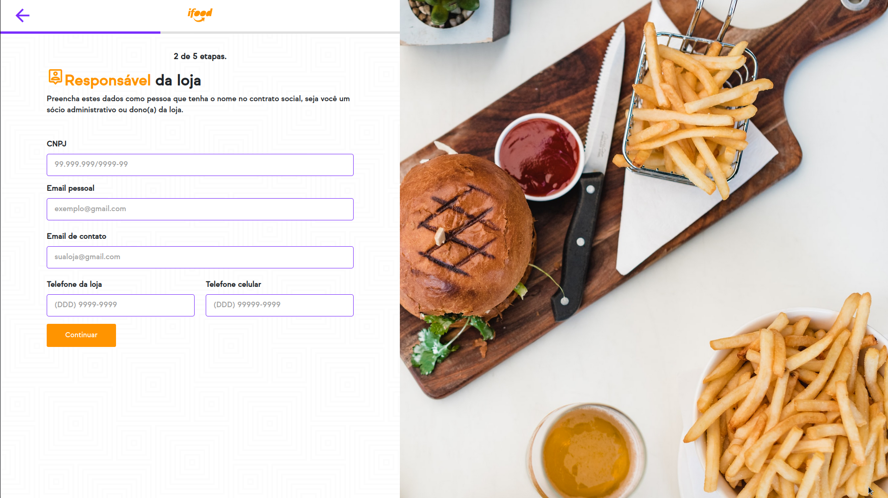

# Delivery App (ADMINISTRADOR)

Concorrente [neemo](https://www.neemo.com.br/?utm_source=google&utm_medium=cpa&utm_campaign=ads-ativar&utm_term=neemo-ativar&gclid=CjwKCAjw8sCRBhA6EiwA6_IF4bQf44-K8xx3ZXRjdlpyJl7I-0mNalLqs9y3VR06KpL2w2YokS0mJhoCd_EQAvD_BwE).

## Instalação

No diretório raiz do projeto:

### `npm i ou yarn`

## Executar

### `npm start ou yarn start`

Executa o aplicativo no modo de desenvolvimento.\
Abra [http://localhost:3000](http://localhost:3000) para visualizá-lo no navegador.

## Prévias de desenvolvimento

### /login

\
Login de usuário do administrador da loja.

### /register

\
Local onde o dono ou responsável irá cadastrar sua loja.

### /home

\
Local onde o dono ou responsável irá gerenciar sua loja.

### @Author
Hector Rodrigues da Silva.